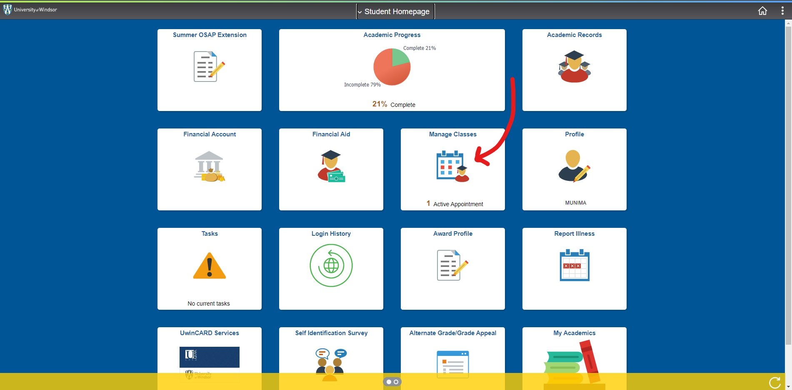
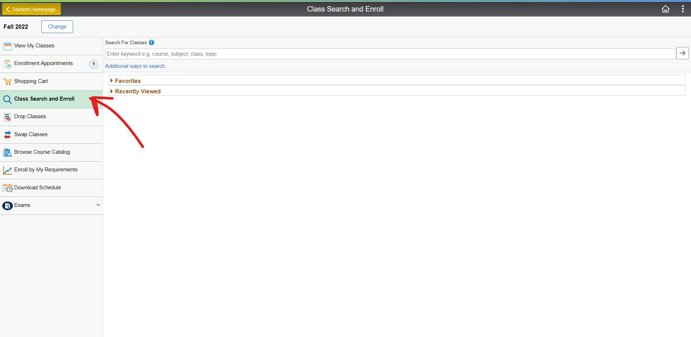
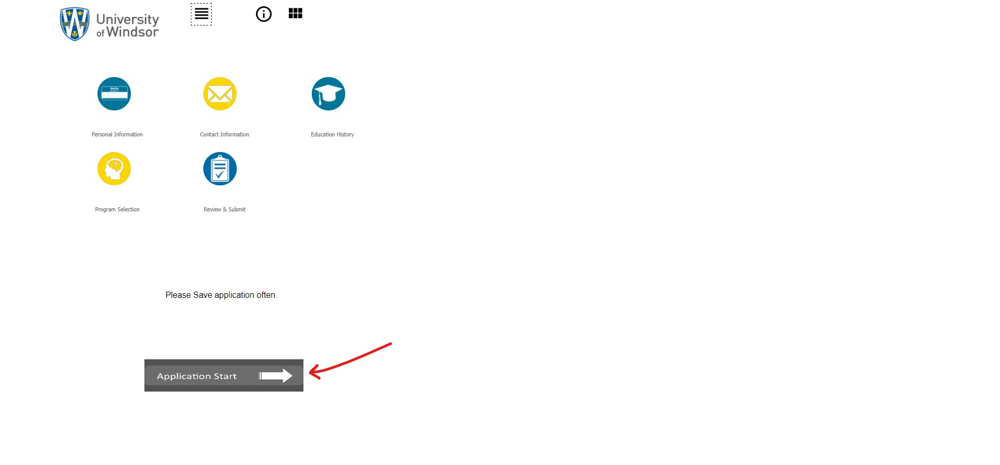

_Last updated on 2022/06/25_

This is a guide on how to use and access the important sections on your UWinsite Student page.

## Course Management

### How to Plan & Enroll in Classes

To plan your courses and register in classes in UWinsite Student, you will use the
**Manage Classes** section on the Student Homepage.

#### Planning your Classes

You can start planning your classes and adding them to your Shopping Cart in UWinsite
Student when the validation period opens. The validation period is when the timetable
for the next semester is close to final and the courses being offered are visible in
UWinsite Student. Typically, the validation period starts two to three weeks before
registration begins.

The preferred method for placing your classes into the Shopping Cart is through Class
Search and Enroll. This method shows you just the courses that are offered during the
term for which you are planning.

**To get started planning your classes:**

1. On the Student Homepage, click the Manage Classes tile.
2. Click the Class Search & Enroll tab in the left navigation menu.

3. Select the term in which you will be registering.
4. In the Search for Classes field, enter a subject area, topic or course code.
5. From the Search Results, select a course.
6. On the **Course Information** page you will see all class sections for the term you
selected. Some classes have one section while others have multiple sections. Under
**Class Selection**, you can view the time, date, instructor, location and available seats
for each section of the class.

7. Select a class section. You can click anywhere on the class except for the Lecture or
Lab link to select it.
8. You’ll now be directed to the confirmation process:
    1. Review **Class Selection** and click **Next**
    2. Review **Class Preferences**
        + This is where you have the option to add yourself to the waitlist if the class is
        full. Select **Yes** if this will not put you in course overload (*normally 5 classes, but
        check your program*). 
        + Select **No** if having this course on the waitlist would put you in course overload.
        You will instead need to use **Swap Classes** so UWinsite Student knows what
        course to drop if you are to reach the top of the waitlist.
    3. Click **Accept**
    4. On the **Enroll** or **Add to Cart** page, click the **Add to Shopping Cart** button and
    then click **Next**.
    5. On the **Review and Submit** page, review your selections and then click **Submit**.

#### Registering in your Classes

Registration at UWindsor is by appointment time. Registration appointment times are
assigned based on a number of factors including program and level of study. Your registration appointment time is
assigned based on several factors including program and level of study. Your registration appointment time is
when you can start to register. It is important to register early to have a better chance
of getting into the classes that you want to take. Registration does, however, remain
open until the tenth day of classes so you may make changes to your courses so long
as there is space.

Once registration appointment times are assigned for a term, you can find yours under
**My Academics -> Enrolment Deadlines**. Your registration appointment time will also be
sent to your UWindsor email account.

**When your registration appointment time opens:**

1. On the Student Homepage, click the **Manage Classes** tile.
2. Click the **Shopping Cart** tab in the left navigation menu.
3. Click the radio button next to each of your preferred classes and then click the **Enroll** button.
    + If you are successfully enrolled in a class, you will see a **green check mark** beside it.
    + If you are not enrolled in a class, you will see a **red X** beside it. 
4. There are several reasons why you might not be successfully enrolled in a class:
    + The class is full.
    + There is a time conflict
    + Enrolment in the class is restricted for various reasons. For example: it is reserved
    for students in particular majors or levels of study.
    + You may be missing a prerequisite (this should not be the case IF you validated
    your classes).

## Financial Information

### Financial Account

**In this section, you'll find:**
+ Your account balance including what you owe, charges, deposits and anticipated aid
+ Payment history
+ Account services

#### Account Balance

The first tab on your left will be your **Account Balance**. You can see the amount balance due now without clicking on it. If you want to see a detailed breakdown of what you owe, click on the **Account Balance Due Now** tile on the left of your screen. 

You'll now see what you owe broken down by fees per semester. Here, you can see what **Charges & Deposits** have been made to your account. The amount you see in the **Pending Financial Aid** is what you'll recieve in financial aid from OSAP and/or scholarships when the funding gets approved. 

You can also request a certain statement depending on what you select in the term box. The **Current** selection will give you the summary of all outstanding charges regardless of term. A **term specific** statement will only give you a summary of all outstanding charges of that said term.

To generate a statement of your charges, click the **Print Student Statement** box. You'll get a PDF file of the statement.

#### Charges Due

The next tab on the left: **Charges Due** will allow you to view your charges and what you owe by two methods. 

In the **Summary By Due Date** section, you'll see a breakdown of any charges you owe and the date they are due. In the **Detail Of Charges Due** section, you'll see the description of the fees you owe, the charge date, the term and the charge amount. 

#### Account Services 

The **Account Services** tab on the left has four subcategories:
+ **Charges Due:** provides a summary by due date of the charges and deposits that you owe
+ **Opt Out Drug and Dental:** gives you the option to opt out of your drug and dental insurance 
+ **Income Tax Forms:** allows you to request an income tax T2202A or T4A form by selected year.
    
    1. Select a year
    2. Click the dropdown arrow to select an income tax form type
    3. Click on **download**
+ **Online Refund Request:** allows you to request a refund form from the university

## Academics

### My Academics

Here, you'll see your **Academic Summary**, **Enrollment Deadlines**, **Student Evaluation of Teaching**, **a Change of Program Application**, **a Returning Student Application**, **Service Letters**, and **Apply to Graduate**

#### Student Academic Summary

Your summary is broken down into your academic structure. It'll give you a rundown of what you're studying at the University. This section goes into detail regarding your term and when you're expected to graduate.

Further down, you'll see your **term summary**. You can click on the term you wish to view in detail and it will give you the option to add or change a minor. You can also view the details regarding the number of credits of any courses, you dropped, wait-listed, or that you're currently enrolled in.

#### Enrollment Deadlines

Here, you can view your appointments and enrollment dates for another term including the session, when the appointment starts, and the last date to enroll.

#### Change of Program Application

Here, current students can change their programs and this is also for students who applied for part-time studies who wish to apply for full-time studies. You'll also see the deadlines of the application for each term.

To start a change of program application: 
1. Click **Create New Application**. You will see a variety of areas that need to be completed. 
2. Now, click the **Application Start** button which you may need to scroll down to see. 

3. Then, complete the required fields on the page. 
4. Once you complete a page of your application, click the **Save** button to save what you've filled 
5. Click the **Continue** button to proceed to the next page and do the same until all pages have been filled.
6. When you complete your application, click **Submit Application** 

:::note 
*Make sure you save your application often. You can also save what you've currently filled and come back another time to complete the rest of your application.*
:::

#### Returning Student Application

This form is for **inactive students**. It functions the same way as the Change of Program Application.

#### Self Service Letters

You can request a variety of self service letters in this section: 

+ **Attestation Letter**: If you're a student travelling outside of Canada and need a letter to prove the University of Windsor is an accredited institution, you'll request an attestation letter
+ **CO-OP Letter**: Allows international students to apply to be eligible to work during their duration at the University of Windsor 
+ **Enrollment Verification Letter**: Is a student's proof of registration. It shows a student's current status and prjected completion date
+ **Gradutation Letter**: Students who have applied to graduate and have successfully completed their program requirements will recieve a graduation letter
+ **Student Snapshot**: A current view of a student's enrollment status

### Academic Progress

In this section, you'll be able to see your **Academic Progress Summary**, **Program Requirements**, and your **What-if Report**.

#### Academic Progress Summary

This tab shows you the graphical representation of your academic progress. 

#### Academic Progress

This tab gives you an in-depth look at your academic progress. Academic Progess breaks down your program requirements. You will be able to view bar charts showing the completion level of your program requirements.

#### What-if Report

The What-if Report allows you to view **what requirements you need to fulfill if you decided to switch programs**. 

To run a What-if Report: 
1. Click **Create New Report** in the **View What-if Report** tab. 

2. Then you choose your **Career** followed by your **Academic Program**, then your **Area of Study**, and then your **Concentration**. 
3. After that, click **Browse Course Catalog**. 
4. Then select **Subject Codes** for inclusion in your course what-if report. 
5. Now, click **Submit Request**. 

The system will generate a response based on your choices. You will be provided with what course will be required and what courses do not fulfill your academic program requirements. 

### Academic Records

#### Course History

Course History allows you to view the courses you have completed, transferred from, are planning to take, and that are currently in progress. You can see the **status** of each of your courses on the right hand side.

#### View Grades

Here, you can look at your grades by semester. Choose what semester you would like to view and you'll see a listing of the courses you took including the grades you recieved and the units/credits the course is worth. 

:::note
**units = credits**. 
:::

An undergraduate student also has an option to **submit a request to appeal a grade**. 
If you are not satisfied with a grade you receive in any course, you should first discuss it with the **individual instructor** who assigned the grade. You should make every effort to resolve the issue with the instructor by outlining the reasons for your dissatisfaction and attempt to come to a mutually agreeable resolution.

If you are unable to resolve the problem with your instructor, you may consider formally appealing your grade based on **Incorrect Evaluation** or **Procedural Irregularity**. Students who wish to appeal a grade in a course must submit a Grade Appeal through UWinsite Student **no later than three weeks after the final grade has been posted**. A letter of rationale and supporting documentation must accompany the appeal form along with an administrative fee of $20 (this fee will be refunded if your appeal is successful). An appeal for compassionate reasons do not have an administrative fee of $20. 
If you are unable to resolve the problem with your instructor, you may consider formally appealing your grade based on **Incorrect Evaluation** or **Procedural Irregularity**. Students who wish to appeal a grade in a course must submit a Grade Appeal through UWinsite Student **no later than three weeks after the final grade has been posted.** A letter of rationale and supporting documentation must accompany the appeal form along with an administrative fee of $20 (this fee will be refunded if your appeal is successful). An appeal for compassionate reasons do not have an administrative fee of $20. 

There are two types of appeals: **Administrative** appeal and **Medical/Compassionate** appeal.

To **submit an appeal**: 
1. Click the **Appeal/Consideration** button.
2. Click **Create**. 
3. Select the appeal **type** as **Administrative** or **Medical/Compassionate**
    + Select the appeal type: **Administrative** if you are submitting an appeal based on incorrect evaluation or procedural irregularity
        + After you finish **steps 5-8**, click **Pay Appeal Fee**
    + Select the appeal type: **Medical/Compassionate** if you are appealing for extenuating circumstances or on other compassionate grounds.
4. Click **Ok**
5. Select whatever answer that suits your situation in the dropdown box

6. Upload any supporting documents you may have in the **Supporting Details** section
7. You may elaborate further about your appeal in the **Detail Reason for Appeal** box
8. Click **Submit**

:::note
*Follow the instructions carefully. Once you have submitted a file, you can view it, but you can't make any changes.*
:::

## Your Profile

You can see your profile when you click the **tile that's titled Profile** on the mainpage of the UWinsite Student

When you click on that tile, you can see your **student ID** on the top left corner of your screen. It's recommended that you have it memorized. It's also on your UWindsor student card.

In this section, you'll also see your **Contact Details** (*email and phone number*), your **Home Address**, your **Emergency Contacts**, and your **Personal Details** (*Date of birth, gender, and SIN*). You have the option to update this information if you need to. 
